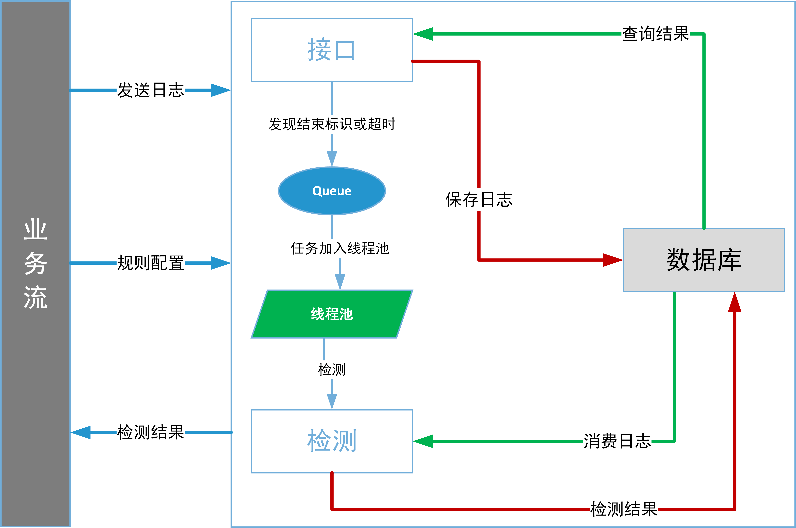

# 卷宗业务流程管理

1. 目前采用MySql 作为唯一数据源
2. 使用sqlalchemy建立ORM
3. 一个监听进程负责持续获取数据库新入日志
4. task_queue作为 计划工作的缓存器
5. 检测模块从task_queue获取工作
6. 检测结果存入数据库

## requires
1. pip install sqlalchemy
2. pip install pymysql
